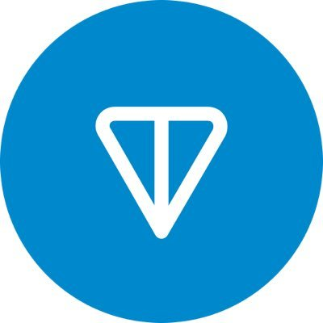
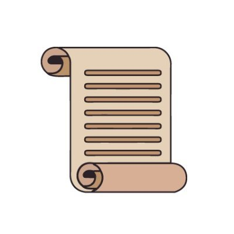
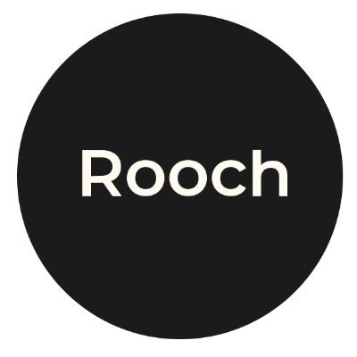

# 🥰 Integration Partners

<figure><figcaption>
UPDAO
</figcaption></figure>

 

<figure><figcaption>
7UPDAO
</figcaption></figure>

 

<figure><figcaption>
Arbitrum
</figcaption></figure>

<figure><figcaption>
Ton
</figcaption></figure>

 

<figure><figcaption>
Scroll
</figcaption></figure>

 

<figure><figcaption>
Arweave
</figcaption></figure>

<figure><figcaption>
Edenhzrd
</figcaption></figure>

 

<figure><figcaption>
RoochNetwork
</figcaption></figure>

