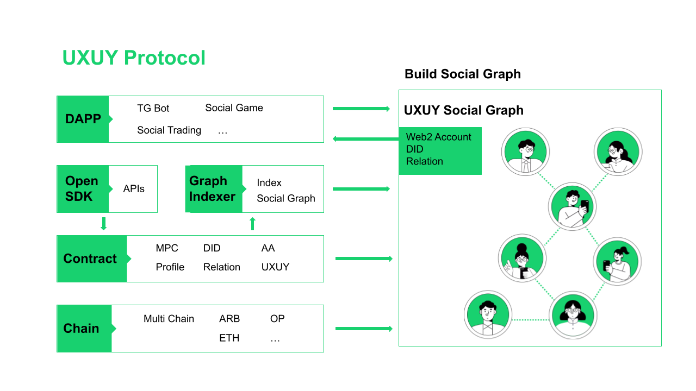
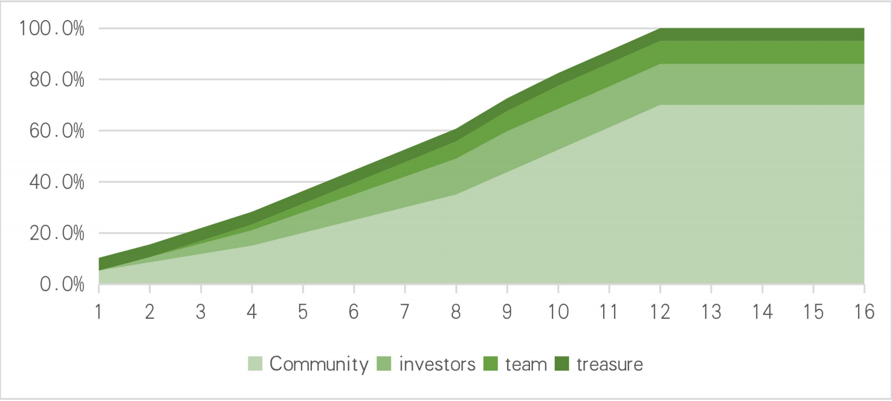

# 📰 White Paper(Alpha Version)

### Abstract:

UXUY is a block-chain based social protocol for assets, with the vision to be a trusted infrastructure product for mass adoption of inclusive finance and trading. There are three goals of UXUY:

* To serve as a trusted, value creating infrastructure product to enhance the trust of the entire web world, with a focus on the financing and trading areas.
* To cater to both Web3 and Web2 users, facilitating mass adoption, serving 100 million users.
* To establish fair and rewarding social-nomics and community.

The major features of UXUY include MPC-based UXWallet, Integrated DID, Zero Knowledge powered Social Profile, Plug-and-Play Composability, Multi-chains Supports, and associated other features. All the features are designed under the philosophy of user sovereignty, inclusion for users and developers, and synergize with real-world connections.

Once users are connected by the protocol, UXUY will be the infrastructure of social and socialized financing and trading. UXUY will enable users to secure and monetize their social assets, bringing in various Dapps such as game, marketing tools; UXUY will also integrate inclusive finance and trading functions and Dapps, offering useful and affordable services for people in need.

UXUY adopt a dual-token economics to strike a balance among simplicity, fairness, and effectiveness.

### 1.Real life problems we are facing: ownership, trust and inclusive finance

#### 1.1 Lack of clarity in social data ownership, although social data and networks are valuable and irreplaceable assets for all

Ownership is the foundation of value sharing. Web2 users generate a significant amount of data, but they own and benefit little from centralized web world. The data ownership issue also prevents developers from bootstrapping innovative products and features. Developers need users’ connections to initiate network effects, but the lack of accessible and composable data which should be owned by the users.

#### 1.2 Trust is still one of biggest concerns for web3 users.

Despite blockchain technology being designed to address trust issues in the web world, rug pulls continue to occur very often. This is partially caused by the anonymous mechanism.

#### 1.3 Huge groups of people are still underserved financially, inclusive finance is in need.

According to the 2021 World Bank Global Findex, more than 20% of adults (age 15+) are unbanked, not to mention other financial services.Block-chain technology, born to solve finance problems, may help people earn, protect themselves in times of crisis, and to build financial health and resilience.

## 2.UXUY protocol and networks are the solutions to the issues

To overcome the stated issues, we are creating a mid-layer, infrastructure for users and developers, where users can truly own and thus benefit from their social assets; developers can build useful applications and features, while leveraging pre-existing real world social connections among users to grow their audiences.


### 2.1 Design philosophy and principles

While UXUY is evolving, we formed below 3 core principles and philosophy as the guidelines:

**User sovereignty first.** User sovereignty includes users having ownership and control over online identities, social connections, social data, with data privacy protection.

**Inclusion for users and developers.** For users, we create and choose friendly products and technology for both web2 and web3 environments; for developers, we provide completely open-sourced, easy programmed infrastructure that Dapps can be easily integrated wit. Inclusion leads to scalability.

**Synergize with real-world connections.** We do believe real world connections represent and reflect an individual's reputation, credibility, and values. This fills a key gap that has been missing so far in the blockchains and token-powered protocols.

### 2.2 Major features and functions

#### UXWallet, based on MPC (Multi-Party Computation)

**Integrated DID, web2 directly to web3.** Users can create Web3 accounts through Telegram, WhatsApp, etc,, reducing the threshold for users to enter Web3. Web3 DIDs reflect and capture users’ existing real-world connections

**Social Profile, By ZK (Zero-knowledge proof) technology.** Users own and utilize their self-sovereign identities (SSI) and social relationships with privacy protection, UXUY Profile is a way of representing data on status, affiliation, and social verification using encrypted web3 native methods.

**Plug-and-Play composability.** UXUY protocol is to design and implement information storage and usage standards shared among DAPPs.

**Multi-chains Support.** UXUY Protocol uses an efficient and secure Arbitrum chain for now, providing UXUY with secure and low-cost technical services. In the future, UXUY will continue to launch on other chains.


### 2.3 Technical Architecture of UXUY protocol

The UXUY Protocol is a pluggable identity verification infrastructure for Web3 applications.

<div data-full-width="true">

<figure><figcaption></figcaption></figure>

</div>

## 3.Usage scenarios

The usage scenarios are 3 layers, taking a user named Alex as an example:

### 3.1 Alex uses UXUY protocol to create his networks in web3, wallets, DIDs, profiles, forming his social assets.

### 3.2 Alex monetize his social networks by providing traffic, data and engagement, such as social games, social marketing, fission for Dapps; on the other hand, Dapps leverage Alex' networks to gain new audiences or engagement while rewarding Alex.

### 3.3 Alex can engage socialized finance and trading, such as swap, light investment, borrowing, payments, credit, and insurance, in a safer and friendly environment, to achieve better returns.


## 4. Revenue Model

In principle, users, rather than UXUY, owners the networks and the data associated. As a consequence, users own the values generated, while UXUY share.

The revenue source for UXUY are three folds:

* Gas fee: There are data owners, and data demanders. If there is data movement, UXUY change certain % of fee as "gas". If Dapps generate revenue in the network, UXUY also changes certain % of fees.
* Service fee: if partners (Dapp creators) need help from community to attract new audiences, service fee may be charged.
* Product sell: community or project may advanced tools or unique identifications such as NFTs

The tokens received include $UXUY and other cryptos. The revenue will be used for community development and tokens price management.

## 5. Token Economics

UXUY Protocol apply a dual-token model, consisting of the protocol’s native utility tokens (UXUY token, $UXUY) and governance tokens (UXUY governance tokens, $UXGT). The dual-token model provides a framework of governance and development of our community and ecosystem, while maximizing the transparency and fairness

### 5.1 UXUY Utility Tokens ($UXUY)

$UXUY is the reward system for UXUY community and ecosystem development, simply and purely based on a fair Proof of Link (POL) mechanism. There is no pre-minted $UXUY. Anyone who wants to earn $UXUY needs to invite other users or contribute to the ecosystem. UXUY Tokens can be stored in an Ethereum-compatible wallet. The earlier the user creates their social network, the more UXUY Tokens they will receive.

#### 5.1.1 UXUY Token Reward Decreasing Formula


```vue
 Rewards = OG * [ TAM(ts) * (1 + EAR（cLg）)* cLu / log2(cLg) ]
```


#### Where:

* TAM(ts0) = <mark style="color:green;">max(3000 - \[(ts0 - tsG)/3600\*24], 1)</mark>
* EAR(cLg) = <mark style="color:green;">max((k/100) - 0.001 \* \[cLg / 100000], 0)</mark>
* OG - Users holding <mark style="background-color:green;">SEAMAN NFTs</mark> are OG users, and their incentive weighting coefficient is <mark style="color:green;">120%</mark>.
* TAM - Time amplifier, incentivizes early adopters.
* EAR - Early Adopter Reward, incentivizes early contributors.
  * For networks with <mark style="color:green;">0-100,000</mark> people, the EAR incentive factor starts at 90%.
  * For networks with <mark style="color:green;">100,000-1,000,000</mark> people, the EAR incentive factor starts at 30%.
  * After <mark style="color:green;">1,000,000</mark> people, the EAR incentive factor decreases to <mark style="color:green;">10%</mark> and decreases linearly by <mark style="color:green;">0.1%</mark> every <mark style="color:green;">100,000</mark> people.
  * k - EAR incentive factor:
    * _<mark style="color:green;">`[cLg < 100,000, k=40].`</mark>_
    * _<mark style="color:green;">`[10 < cLg <`</mark>_ <mark style="color:green;"></mark><mark style="color:green;">1,000,000</mark>_<mark style="color:green;">`, k=20].`</mark>_
    * _<mark style="color:green;">`[cLg >`</mark>_ <mark style="color:green;"></mark><mark style="color:green;">1,000,000</mark>_<mark style="color:green;">`, k=10].`</mark>_\

* ts0 - the current node's establishment time.
* tsG - the project's genesis release start time.
* cLu - the number of people who established the current node.
* cLg - the total number of people in the UXUY network.
* When <mark style="color:green;">cLg >= 30 million</mark>, <mark style="color:green;">Rewards = 0</mark>, which means that no new UXUY Tokens will be produced once the network reaches <mark style="color:green;">30 million</mark>. At that time, the value formed by the network effect can support users and nodes to continue expanding and reach a level of billions.

The <mark style="color:green;">UXUY Token</mark> uses a decrement logic similar to Bitcoin's and uses a computational formula closest to Bitcoin's mining logic. The variables that decrease the Token include time, the number of people connected to a single node, and the total number of people in the <mark style="color:green;">UXUY network</mark>. Therefore, as time passes after the release of <mark style="color:green;">UXUY</mark> and the number of people in the entire <mark style="color:green;">UXUY network</mark> increases, the <mark style="color:green;">UXUY Tokens</mark> earned by users will decrease exponentially, and the later users enter the <mark style="color:green;">UXUY network</mark>, the fewer <mark style="color:green;">UXUY Tokens</mark> they will receive.

#### 5.1.2 UXUY Token Burn Mechanism

UXUY Token is the UXUY Protocol's application token and can be used to pay for Gas fees on-chain in the UXUY ecosystem, including on-chain transactions, transfers, and social network reading. In the UXUY ecosystem, <mark style="color:green;">【15%】</mark>of these fees will be burned.


### 5.2 $UXGT, UXUY Governance tokens

Our to-be-issued governance token - UXGT is to realize governance and value capture from UXUY project and products.&#x20;

#### 5.2.1 Total Supply and Allocation

The tokens have limited supply of no more than 1,000,000,000 and we propose below allocation based on maximized supply.


|              | Composition                                                                                               | %     |
| ------------ | --------------------------------------------------------------------------------------------------------- | ----- |
| Community    | Users who own UXUY utility tokens, and builders and partners contributed to UXUY projects and ecosystems. | 70    |
| Private Sale | Investors invested cash into this project.                                                                | 16.25 |
| Team         | Co-founders, contracted employees, advisors                                                               | 8.75  |
| Treasure     | Reserves for price and liquidity management such as lunch pads, reserves, staking.                        | 5     |

Notes：

* Among the 70% of community, users account \~40% while all other types of builders and partners account \~30%.
* For development of the project, new investors would be in, and this would change the distributions. we will keep the change transparent if it occurs.

#### 5.2.2 release schedule

Please note the starting point is upon listing, not TGE

* Community: the UXGT will be airdropped to active users, builders and partners based on the proof of work/UXUY tokens monthly-basis. Once airdropped, there is no lock up and release schedule required.
* Investors: Lock up 3 months, and then 2-years linear quarterly release. 12.5% per quarter for 8 quarters.
* Team: lock up 6 months, and then 2-years linear quarterly release. 12.5% per quarter for 8 quarters.
* Treasure: flexible to meet the need of pricing and liquidity

Below is the indicative maximized supply of UXGT since listing in 16 quarters, 4 years.


<figure><figcaption></figcaption></figure>

notes:

* Assuming the treasure (5%) is released when listing, the circulation supply would be around 10% of max supply; if not, the circulation supply would be around 5% of max supply.
* By end of 12th quarter, if the project reaches 30,000,000 users, the total supply would reach the max.

#### 5.2.3 The total supply of $UXGT to community

The total supply of $UXGT to community is directly related to the POW/POL of users and various builders, and thus shows positive correlation with the total numbers of users. According to our utility tokens generation formular: the maximized potential supply will occur when the total qualified users achieve 30,000,000; the networks' utility and gravity can support growth without a reward system beyond 30,000,000 users.

The $UXGT release according to the total number of users; time axis is an indirect factor, indicating that:

* If total number of users reaches 30,000,000 earlier than scheduled, more $UXGT will be release earlier.
* If the total number of users reaches 30,000,000 later than scheduled, the maximized supply will take longer time to released.

### Summary:

<mark style="color:green;">UXUY</mark> is a blockchain-based social protocol designed to secure, monetize, and optimize users' social assets. The protocol uses a fair Proof of Link (POL) mechanism, with UXUY tokens as the reward. Users can earn rewards by building social network nodes on the UXUY protocol, and UXUY tokens can also be used to purchase other services or goods in the WEB3 world.

<mark style="color:green;">UXUY</mark> is creating a new WEB3 social ecosystem, and various DAPPs will be gradually integrated into the <mark style="color:green;">UXUY protocol</mark>. In the future, the <mark style="color:green;">UXUY ecosystem</mark> will be more diverse.


### FAQ:


[faq.md](../troubleshooting/faq.md)

