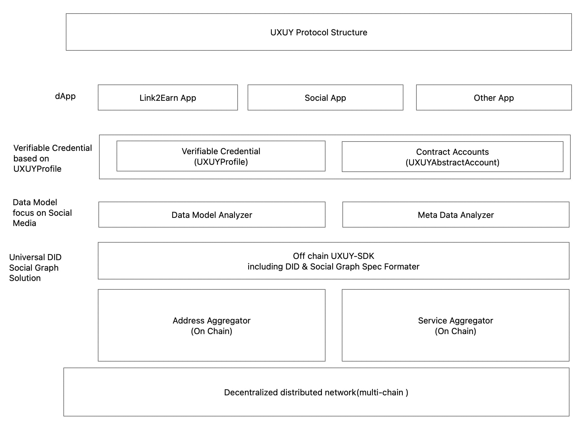

# 📰 White Paper

### Introduction:

Currently, when using centralized social applications, users do not truly own the <mark style="color:green;">social assets</mark> they create (such as social relationships, social data, etc.). When centralized applications change their rules, ban accounts, or stop services, users will lose all their social relationships and personal data. On the other hand, when the application product obtains commercial value from users' <mark style="color:green;">social relationships</mark> and <mark style="color:green;">social data</mark>, users cannot or can rarely benefit from it. These situations are common in the Web2 era.


The <mark style="color:green;">UXUY Social Graph Protocol</mark> aims to secure, monetize and optimize users' social assets. Through the decentralized nature of blockchain, it helps users fully own their social data sovereignty, optimize social assets, and encrypt this information on the chain. <mark style="color:green;">UXUY</mark> fully maintains the interests of decentralized users, helps users protect their social data, and monetizes them. When some DAPPs use users' social relationships and data, users will receive token rewards.


<mark style="color:green;">UXUY</mark> is committed to building the infrastructure to facilitate the next-generation large-scale <mark style="color:green;">Web3 social applications</mark>. It will be served as protocol on the blockchain, ensuring the encryption of data and the scalability of the ecosystem. We named this infrastructure protocol "<mark style="color:green;">UXUY Protocol</mark>". UXUY Protocol uses "<mark style="color:green;">UXUY Token</mark>" as an incentive token, and uses the <mark style="color:green;">POL (Proof Of Link)</mark> mechanism to record users' contributions to the entire social network. The larger and more valuable the social network built by users, the more token rewards they will receive. Tokens can also be used to purchase services in other DAPPs or in other scenarios.

### Features of the UXUY protocol:

#### Web2 directly to Web3&#x20;

Users can create Web3 accounts through Google, Twitter, Wechat, etc. <mark style="color:green;">UXUY</mark> provides users with an encrypted <mark style="color:green;">MPC</mark> wallet, which can be used and experienced in Web3 applications without recording complex public and private keys, reducing the threshold for users to enter Web3, and maximizing the value of users' social accounts in Web2.

#### Proprietary Profile

Through the <mark style="color:green;">UXUY protocol</mark>, users can create their on-chain profile, <mark style="color:green;">UXUY Profile</mark>, as an anchor for their self-sovereign decentralized identity, seamlessly connecting and using between the Internet and blockchain DAPPs. <mark style="color:green;">UXUY Profile</mark> is a way of representing data on status, affiliation, and social verification using encrypted web3 native methods.

#### Composable and Plug-and-Play

The biggest technological innovation contribution of the <mark style="color:green;">UXUY protocol</mark> is the design and implementation of information storage and usage standards <mark style="color:green;">shared</mark> among DAPPs. As the foundation of social networks in Web3, it can be combined into any Web3 application, making it easier for DAPP developers to develop and obtain more Web3 users.

#### Multi-Chain Support

<mark style="color:green;">UXUY Protocol</mark> uses efficient and secure Arbitrum chain and has obtained support from Arbitrum, providing UXUY with secure and fast technical services. In addition, UXUY will continue to launch on other chains in the future, and the UXUY ecosystem will be more abundant.


### Technical Architecture of the UXUY Protocol

The <mark style="color:green;">UXUY Protocol</mark> is a pluggable identity verification infrastructure for Web3 applications.

<figure><figcaption><p>I</p></figcaption></figure>

### UXUY Protocol TokenomicsII.&#x20;

The UXUY Protocol will use a dual-token model, consisting of the Application Token (UXUY Token) and the Governance Token (UXUY Governance Token).

#### 1.UXUY Application Token

&#x20;1.1 UXUY Token Reward System

<mark style="color:green;">UXUY Token</mark> does not have any pre-mined tokens and adopts a fair <mark style="color:green;">Proof of Link (POL)</mark> mechanism. To earn UXUY Token, anyone must contribute to the development of the Web3 social network. Users need to expand their social network by inviting other users to earn more UXUY Tokens. UXUY Tokens can be stored in an Ethereum-compatible wallet. For every successful connection of a social node (inviting one person), the user can earn a certain amount of UXUY Token rewards. The earlier the user creates their social network, the more UXUY Tokens they will receive.


1.2 UXUY Token Reward Decreasing Formula


```vue
 Rewards = OG * [ TAM(ts) * (1 + EAR（cLg）)* cLu / log2(cLg) ]
```


#### Where:

* TAM(ts0) = <mark style="color:green;">max(3000 - \[(ts0 - tsG)/3600\*24], 1)</mark>
* EAR(cLg) = <mark style="color:green;">max((k/100) - 0.001 \* \[cLg / 100000], 0)</mark>
* OG - Users holding <mark style="background-color:green;">SEAMAN NFTs</mark> are OG users, and their incentive weighting coefficient is <mark style="color:green;">120%</mark>.
* TAM - Time amplifier, incentivizes early adopters.
* EAR - Early Adopter Reward, incentivizes early contributors.
  * For networks with <mark style="color:green;">0-100,000</mark> people, the EAR incentive factor starts at 90%.
  * For networks with <mark style="color:green;">100,000-1,000,000</mark> people, the EAR incentive factor starts at 30%.
  * After <mark style="color:green;">1,000,000</mark> people, the EAR incentive factor decreases to <mark style="color:green;">10%</mark> and decreases linearly by <mark style="color:green;">0.1%</mark> every <mark style="color:green;">100,000</mark> people.
  * k - EAR incentive factor:
    * _<mark style="color:green;">`[cLg < 100,000, k=40].`</mark>_
    * _<mark style="color:green;">`[10 < cLg <`</mark>_ <mark style="color:green;"></mark><mark style="color:green;">1,000,000</mark>_<mark style="color:green;">`, k=20].`</mark>_
    * _<mark style="color:green;">`[cLg >`</mark>_ <mark style="color:green;"></mark><mark style="color:green;">1,000,000</mark>_<mark style="color:green;">`, k=10].`</mark>_\

* ts0 - the current node's establishment time.
* tsG - the project's genesis release start time.
* cLu - the number of people who established the current node.
* cLg - the total number of people in the UXUY network.
* When <mark style="color:green;">cLg >= 30 million</mark>, <mark style="color:green;">Rewards = 0</mark>, which means that no new UXUY Tokens will be produced once the network reaches <mark style="color:green;">30 million</mark>. At that time, the value formed by the network effect can support users and nodes to continue expanding and reach a level of billions.

The <mark style="color:green;">UXUY Token</mark> uses a decrement logic similar to Bitcoin's and uses a computational formula closest to Bitcoin's mining logic. The variables that decrease the Token include time, the number of people connected to a single node, and the total number of people in the <mark style="color:green;">UXUY network</mark>. Therefore, as time passes after the release of <mark style="color:green;">UXUY</mark> and the number of people in the entire <mark style="color:green;">UXUY network</mark> increases, the <mark style="color:green;">UXUY Tokens</mark> earned by users will decrease exponentially, and the later users enter the <mark style="color:green;">UXUY network</mark>, the fewer <mark style="color:green;">UXUY Tokens</mark> they will receive.


1.3 UXUY Token Burn Mechanism

UXUY Token is the UXUY Protocol's application token and can be used to pay for Gas fees on-chain in the UXUY ecosystem, including on-chain transactions, transfers, and social network reading. In the UXUY ecosystem, <mark style="color:green;">15%</mark> of these fees will be burned.


#### 2.UXUY Governance Token

2.1 In the future

<mark style="color:green;">UXUY</mark> will also launch a community governance token (tentatively named <mark style="color:green;">UXUY Governance Token or UGT</mark>), with the majority of the governance token allocation going to the community and a small portion going to partners, team, and investors.

### Summary:

<mark style="color:green;">UXUY</mark> is a blockchain-based social protocol designed to secure, monetize, and optimize users' social assets. The protocol uses a fair Proof of Link (POL) mechanism, with UXUY tokens as the reward. Users can earn rewards by building social network nodes on the UXUY protocol, and UXUY tokens can also be used to purchase other services or goods in the WEB3 world.

<mark style="color:green;">UXUY</mark> is creating a new WEB3 social ecosystem, and various DAPPs will be gradually integrated into the <mark style="color:green;">UXUY protocol</mark>. In the future, the <mark style="color:green;">UXUY ecosystem</mark> will be more diverse.


### FAQ:


[faq.md](../troubleshooting/faq.md)

